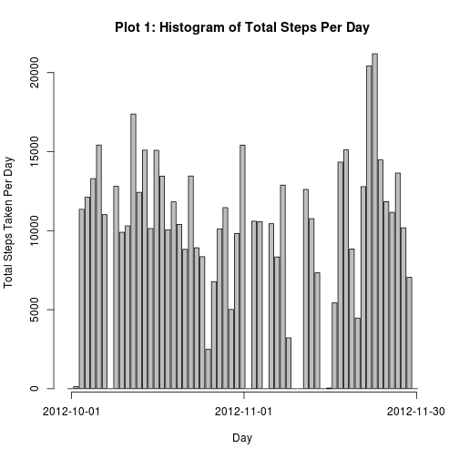
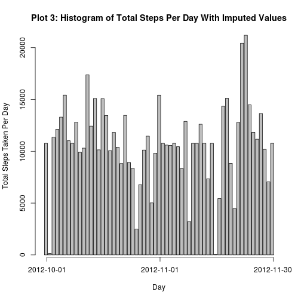

# Reproducible Research: Peer Assessment 1


```r
setwd("/home/bjoseph/RepData_PeerAssessment1")
# install.packages('knitr')
install.packages("knitr", dependencies = TRUE)
```

```
## Installing package into '/home/bjoseph/R/x86_64-pc-linux-gnu-library/3.0'
## (as 'lib' is unspecified)
## also installing the dependency 'rgl'
```

```
## 
## The downloaded source packages are in
## 	'/tmp/RtmpJlQ16B/downloaded_packages'
```

```r
library(knitr)
library(ggplot2)
library(plyr)
library(reshape2)
```

## Loading and preprocessing the data

```r

dat <- read.csv("activity.csv")

```

## What is mean total number of steps taken per day?

### Mean Steps

```r

MeanSteps <- tapply(dat$steps, dat$date, function(x) mean(x, na.rm = TRUE))

MeanSteps
```

```
## 2012-10-01 2012-10-02 2012-10-03 2012-10-04 2012-10-05 2012-10-06 
##        NaN     0.4375    39.4167    42.0694    46.1597    53.5417 
## 2012-10-07 2012-10-08 2012-10-09 2012-10-10 2012-10-11 2012-10-12 
##    38.2465        NaN    44.4826    34.3750    35.7778    60.3542 
## 2012-10-13 2012-10-14 2012-10-15 2012-10-16 2012-10-17 2012-10-18 
##    43.1458    52.4236    35.2049    52.3750    46.7083    34.9167 
## 2012-10-19 2012-10-20 2012-10-21 2012-10-22 2012-10-23 2012-10-24 
##    41.0729    36.0938    30.6285    46.7361    30.9653    29.0104 
## 2012-10-25 2012-10-26 2012-10-27 2012-10-28 2012-10-29 2012-10-30 
##     8.6528    23.5347    35.1354    39.7847    17.4236    34.0938 
## 2012-10-31 2012-11-01 2012-11-02 2012-11-03 2012-11-04 2012-11-05 
##    53.5208        NaN    36.8056    36.7049        NaN    36.2465 
## 2012-11-06 2012-11-07 2012-11-08 2012-11-09 2012-11-10 2012-11-11 
##    28.9375    44.7326    11.1771        NaN        NaN    43.7778 
## 2012-11-12 2012-11-13 2012-11-14 2012-11-15 2012-11-16 2012-11-17 
##    37.3785    25.4722        NaN     0.1424    18.8924    49.7882 
## 2012-11-18 2012-11-19 2012-11-20 2012-11-21 2012-11-22 2012-11-23 
##    52.4653    30.6979    15.5278    44.3993    70.9271    73.5903 
## 2012-11-24 2012-11-25 2012-11-26 2012-11-27 2012-11-28 2012-11-29 
##    50.2708    41.0903    38.7569    47.3819    35.3576    24.4688 
## 2012-11-30 
##        NaN
```


### Median Steps

```r

MedianSteps <- tapply(dat$steps, dat$date, function(x) median(x, na.rm = TRUE))
MedianSteps
```

```
## 2012-10-01 2012-10-02 2012-10-03 2012-10-04 2012-10-05 2012-10-06 
##         NA          0          0          0          0          0 
## 2012-10-07 2012-10-08 2012-10-09 2012-10-10 2012-10-11 2012-10-12 
##          0         NA          0          0          0          0 
## 2012-10-13 2012-10-14 2012-10-15 2012-10-16 2012-10-17 2012-10-18 
##          0          0          0          0          0          0 
## 2012-10-19 2012-10-20 2012-10-21 2012-10-22 2012-10-23 2012-10-24 
##          0          0          0          0          0          0 
## 2012-10-25 2012-10-26 2012-10-27 2012-10-28 2012-10-29 2012-10-30 
##          0          0          0          0          0          0 
## 2012-10-31 2012-11-01 2012-11-02 2012-11-03 2012-11-04 2012-11-05 
##          0         NA          0          0         NA          0 
## 2012-11-06 2012-11-07 2012-11-08 2012-11-09 2012-11-10 2012-11-11 
##          0          0          0         NA         NA          0 
## 2012-11-12 2012-11-13 2012-11-14 2012-11-15 2012-11-16 2012-11-17 
##          0          0         NA          0          0          0 
## 2012-11-18 2012-11-19 2012-11-20 2012-11-21 2012-11-22 2012-11-23 
##          0          0          0          0          0          0 
## 2012-11-24 2012-11-25 2012-11-26 2012-11-27 2012-11-28 2012-11-29 
##          0          0          0          0          0          0 
## 2012-11-30 
##         NA
```

### Total Steps

```r

TotalSteps <- tapply(dat$steps, dat$date, function(x) sum(x, na.rm = TRUE))


barplot(TotalSteps, ylab = "Total Steps Taken Per Day", xlab = "Day", main = "Plot 1: Histogram of Total Steps Per Day", 
    xaxt = "n")
axis(1, at = c(1, 74/2, 73), labels = c("2012-10-01", "2012-11-01", "2012-11-30"))
```

 

## What is the average daily activity pattern?


```r
StepsInterval <- tapply(dat$steps, dat$interval, function(x) mean(x, na.rm = TRUE))

plot(StepsInterval, type = "l", xlab = "Interval", ylab = "Mean Steps per Interval", 
    main = "Plot 2: Mean Steps Per 5 Minute Interval", xaxt = "n")
axis(1, at = c(1, 142, 289), labels = c("0", "1145", "2355"))
```

 

```r

StepsInterval[which(StepsInterval == max(StepsInterval))]
```

```
##   835 
## 206.2
```


## Imputing missing values
### I use mean imputation by interval


```r
sum(is.na(dat$steps))
```

```
## [1] 2304
```

```r

impute.mean <- function(x) replace(x, is.na(x), mean(x, na.rm = TRUE))
dat2 <- ddply(dat, ~interval, transform, steps = impute.mean(steps))
MeanStepsImp <- tapply(dat2$steps, dat2$date, function(x) mean(x, na.rm = TRUE))
MedianStepsImp <- tapply(dat2$steps, dat2$date, function(x) median(x, na.rm = TRUE))
TotalStepsImp <- tapply(dat2$steps, dat2$date, function(x) sum(x, na.rm = TRUE))
barplot(TotalStepsImp, ylab = "Total Steps Taken Per Day", xlab = "Day", main = "Plot 3: Histogram of Total Steps Per Day With Imputed Values", 
    xaxt = "n")
axis(1, at = c(1, 74/2, 73), labels = c("2012-10-01", "2012-11-01", "2012-11-30"))
```

 

## Are there differences in activity patterns between weekdays and weekends?
### Yes! It appears people are more active on weekends.
### (Sedentary Lifestyle)

```r
dat$date <- as.Date(dat$date)

dat$day <- weekdays(dat$date)
dat$weekend <- "weekday"
dat$weekend[dat$day == "Saturday"] <- "weekend"
dat$weekend[dat$day == "Sunday"] <- "weekend"
StepsIntervalWeekend <- tapply(dat$steps[dat$weekend == "weekend"], dat$interval[dat$weekend == 
    "weekend"], function(x) mean(x, na.rm = TRUE))
StepsIntervalWeekday <- tapply(dat$steps[dat$weekend == "weekday"], dat$interval[dat$weekend == 
    "weekday"], function(x) mean(x, na.rm = TRUE))

par(mfrow = c(2, 1))
plot(StepsIntervalWeekday, type = "l", xlab = "Interval", ylab = "Mean Steps per Interval", 
    main = "Plot 4: Mean Steps Per 5 Minute Interval on Weekdays", xaxt = "n")
axis(1, at = c(1, 142, 289), labels = c("0", "1145", "2355"))
plot(StepsIntervalWeekend, type = "l", xlab = "Interval", ylab = "Mean Steps per Interval", 
    main = "Plot 5: Mean Steps Per 5 Minute Interval on Weekends", xaxt = "n")
axis(1, at = c(1, 142, 289), labels = c("0", "1145", "2355"))
```

 


## End


